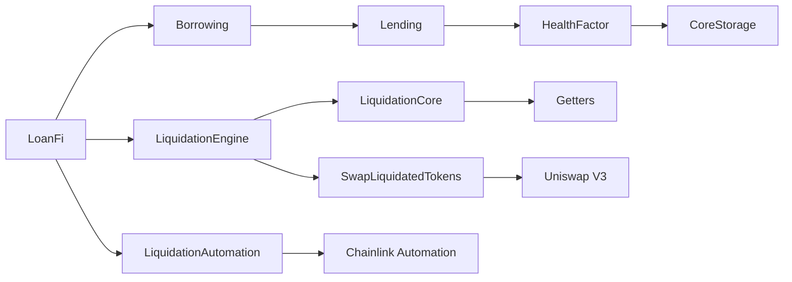

> [!IMPORTANT]  
> This repo is for demo purposes only & is still under development 🚧. Use at your own risk! 

# 🏦 LoanFi Protocol

LoanFi is an advanced decentralized lending protocol that enables users to deposit collateral, borrow assets, and participate in efficient liquidations. Built with security, scalability, and capital efficiency in mind, LoanFi implements sophisticated risk management and automated liquidation mechanisms.

### Supported Assets
The protocol currently supports three major assets:
- Wrapped Ether (WETH)
- Wrapped Bitcoin (WBTC)
- Chainlink (LINK)

### Collateralization and Risk Management
- Users must maintain a minimum collateralization ratio of 200%
- Health factors are continuously monitored using Chainlink price feeds
- Positions below the required ratio become eligible for liquidation

### Innovative Liquidation System
The protocol features a dual-mode liquidation system designed to maintain stability in all market conditions:

1. **Standard Liquidations**
   - When a position's health factor drops below 1, it becomes eligible for liquidation
   - External liquidators can repay a portion of the user's debt
   - In return, they receive the equivalent collateral plus a 10% bonus
   - This incentivizes quick resolution of unhealthy positions

2. **Advanced Bonus Collection**
   - If the liquidated collateral asset has experienced significant price decline:
     - The protocol automatically sources the liquidator's bonus from the user's other deposited collateral
     - This ensures liquidators remain incentivized even during single-asset market stress
     - The bonus collection follows a proportional distribution across available collateral

3. **Protocol-Managed Liquidations**
   - In extreme market conditions (such as collateral flash crashes or others) where user collateral cannot cover the standard bonus:
     - The protocol's automated systems take over
     - Positions are automatically liquidated to protect protocol solvency
     - Remaining healthy collateral is efficiently redistributed
     - Chainlink Automation ensures timely execution

This multi-layered approach ensures:
- Protocol stability in all market conditions
- Continuous liquidation incentives
- Protection against flash crashes
- Efficient capital utilization

## ⭐ Key Features

### 💰 Multi-Collateral Lending
- Support for multiple ERC20 tokens as collateral
- Real-time price feeds via Chainlink oracles
- Flexible collateral ratios and borrowing limits

### 🔄 Advanced Liquidation System
- Dual-mode liquidation mechanism:
  - Market-driven liquidations with competitive bonuses
  - Protocol-managed automated liquidations during market stress
- Waterfall bonus collection system for optimal capital efficiency
- Chainlink Automation integration for reliable position monitoring

### 🛡️ Risk Management
- Dynamic health factor calculations
- Real-time collateral value tracking
- Multi-layered security checks
- Comprehensive position monitoring

### 🏗️ Protocol Architecture

Click To Open ⬇️


The protocol follows a modular architecture with clear separation of concerns:

#### Core Protocol Layer
- **LoanFi**: Main protocol entry point and orchestrator
- **CoreStorage**: Base layer handling state management and access control
- **Lending/Borrowing**: Core lending and borrowing functionality
- **HealthFactor**: Risk assessment and position health calculations

#### Liquidation Layer
- **LiquidationEngine**: Advanced liquidation logic with dual-mode system
- **LiquidationCore**: Core liquidation calculations and bonus distribution
- **SwapLiquidatedTokens**: Efficient token swapping via Uniswap V3

#### Automation Layer
- **LiquidationAutomation**: Chainlink Automation integration
- **Automated Monitoring**: Continuous position health checking
- **Batch Processing**: Gas-efficient position management

#### External Integrations
- **Chainlink Price Feeds**: Real-time price data
- **Chainlink Automation**: Automated liquidations
- **Uniswap V3**: DEX integration for token swaps

This architecture ensures:
- Clear separation of concerns
- Upgradability potential
- Gas efficiency
- System modularity
- Robust security model

## 🔧 Technical Overview

### 🧱 Core Components

1. **Lending & Borrowing (Lending.sol, Borrowing.sol)**
   - Secure collateral management
   - Efficient borrowing mechanisms
   - Precise accounting system

2. **Risk Assessment (HealthFactor.sol)**
   - Sophisticated health factor calculations
   - Real-time position monitoring
   - Liquidation threshold management

3. **Liquidation Engine (LiquidationEngine.sol)**
   - Advanced dual-mode liquidation system
   - Automated position monitoring
   - Efficient bonus distribution mechanism

4. **Automation (LiquidationAutomation.sol)**
   - Chainlink Automation integration
   - Batch processing capabilities
   - Gas-optimized monitoring

### 🔒 Security Features

- Comprehensive input validation
- Reentrancy protection
- Access control mechanisms
- CEI (Checks-Effects-Interactions) pattern implementation
- Formal verification ready code structure

## ⚙️ Protocol Mechanics

### 🔄 Borrowing Process
1. Users deposit supported ERC20 tokens as collateral
2. System calculates borrowing capacity based on collateral value
3. Users can borrow assets up to their allowed limit
4. Health factors are continuously monitored

### ⚡ Liquidation Process
1. **Market-Driven Liquidations**
   - External liquidators repay user debt
   - Receive collateral plus bonus incentive
   - Competitive market-based mechanism

2. **Protocol Liquidations**
   - Activated during market stress
   - Automated position management
   - Ensures protocol solvency

### 📊 Risk Management
- Real-time price feed monitoring
- Dynamic health factor adjustments
- Multi-collateral risk assessment
- Automated position monitoring

## 💻 Development

### 📋 Prerequisites
- Foundry
- Node.js
- Solidity ^0.8.20

### 🔨 Installation

1. Clone the repository

```bash
git clone https://github.com/SquilliamX/LoanFi-Protocol.git
```

2. Install dependencies

```bash
forge install
```

3. Compile LoanFi

```bash
forge build
```

4. Run tests

```bash
forge test
```

5. Run specific test file

```bash
forge test --mt <name_of_test>
```

6. Run coverage report

```bash
forge coverage
```

## 🤝 Contributing

Contributions are welcome! Please feel free to submit a Pull Request. For major changes, please open an issue first to discuss what you would like to change.

Please make sure to update tests as appropriate.

## 🔐 Security

This protocol has been designed with security as a primary concern. However, please note that it has not been audited yet. Use at your own risk.

## 📜 License

This project is licensed under the MIT License

---

_Note: This protocol is a demonstration of advanced Solidity development practices and should not be used in production without thorough auditing._ ⚠️

Built with ❤️ by Squilliam