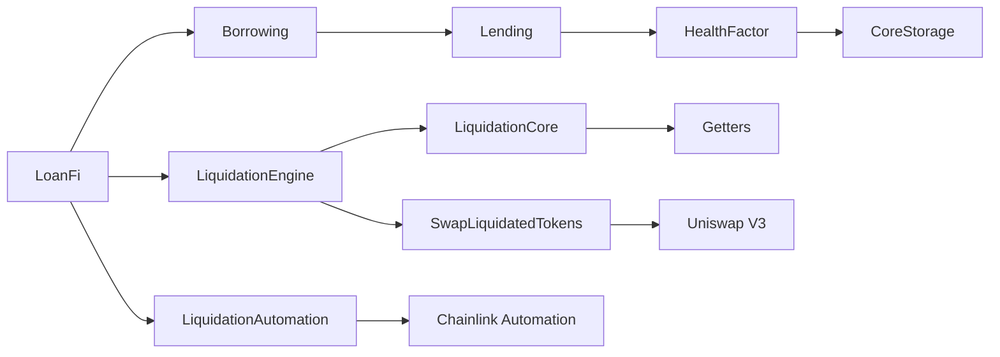
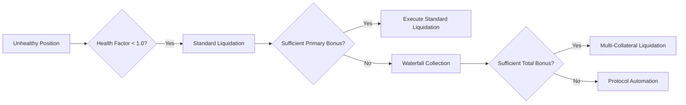
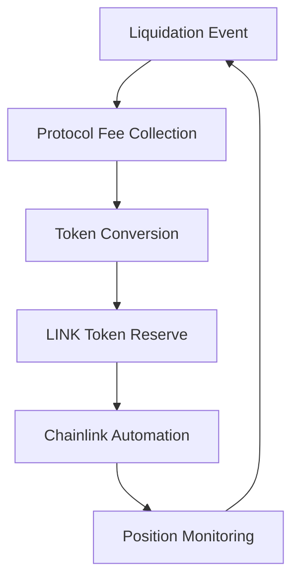

> [!IMPORTANT]  
> This repo is for demo purposes only & has not been audited! Use at your own risk!

# 🏦 LoanFi Protocol

LoanFi is an advanced decentralized lending protocol that enables users to deposit collateral, borrow assets, and participate in efficient liquidations. Built with security, scalability, and capital efficiency in mind, LoanFi implements sophisticated risk management and automated liquidation mechanisms.

## ⭐ Key Features

### 💰 Multi-Collateral Lending
- Support for multiple ERC20 tokens as collateral
   - Wrapped Ether (WETH)
   - Wrapped Bitcoin (WBTC)
   - Chainlink (LINK)
- Real-time price feeds via Chainlink oracles
- Flexible collateral ratios and borrowing limits

### 🔄 Advanced Liquidation System
- Dual-mode liquidation mechanism:
  - Market-driven liquidations with competitive bonuses
  - Protocol-managed automated liquidations during market stress
- Waterfall bonus collection system for optimal capital efficiency
- Chainlink Automation integration for reliable position monitoring
- Self-healing protocol design
- Self-funding mechanism
- Flash crash resilience
- Aligned stakeholder incentives

### 🛡️ Risk Management
- Dynamic health factor calculations
- Real-time collateral value tracking
- Multi-layered security checks
- Comprehensive position monitoring

### 📝 External Integrations
- **Chainlink Price Feeds**: Real-time price data
- **Chainlink Automation**: Automated liquidations
- **Uniswap V3**: DEX integration for token swaps

## 🔧 Technical Overview

### 🏗️ Protocol Architecture

The protocol follows a modular architecture with clear separation of concerns:


This architecture ensures:
- Clear separation of concerns
- Upgradability potential
- Gas efficiency
- System modularity
- Robust security model

### 📊 Core Protocol Layer
The protocol's core contracts follow a carefully designed inheritance pattern, building from base storage up through complex functionality. Each contract layer adds specific capabilities while maintaining a clean separation of concerns and minimal storage overhead.

🏦 **LoanFi.sol**: Main protocol entry point and orchestrator
   - Central access point for all protocol operations
   - Permission management and access control
   - Cross-contract orchestration

💾 **CoreStorage.sol**: Base layer handling state management and access control
   - Optimized storage patterns for gas efficiency
   - Secure state management system
   - Role-based access control (RBAC)
   - Upgradeable storage layout
   - Event-driven state updates
   - Cross-contract data consistency

💸 **Lending.sol & Borrowing.sol**: - Efficient lending & borrowing mechanisms
   - Secure collateral management
   - Precise accounting system
   - Core lending and borrowing functionality:
      1. Users deposit supported ERC20 tokens as collateral
      2. System calculates borrowing capacity based on collateral value
      3. Users can borrow assets up to their allowed limit
      4. Health factors are continuously monitored

❤️‍🩹 **HealthFactor.sol**: Risk assessment and position health calculations
   - Health factors are continuously monitored using Chainlink price feeds
   - Sophisticated health factor calculations
   - Multi-collateral risk assessment
   - Real-time position/priceFeed monitoring
   - Liquidation threshold management

💰 **Withdraw.sol**: Secure collateral withdrawal management
   - Advanced withdrawal safety features:
      - Real-time position validation
      - Health factor verification
      - Slippage-protected withdrawals
   - Atomic execution guarantees:
      - State updates before transfers
      - Transaction rollback on failure
      - CEI pattern implementation
      - Reentrancy protection
   - Flexible withdrawal options:
      - Partial position closure
      - Cross-collateral withdrawals
      - Batch processing support
      - Gas-optimized operations
   - Risk management integration:
      - Pre-withdrawal health checks
      - Post-withdrawal position validation
      - Liquidation threshold monitoring

### 💫 Innovative Liquidation System
The protocol features a dual-mode liquidation system designed to maintain stability in all market conditions:

#### 🌊 Waterfall Liquidation System
The protocol implements a sophisticated three-tier liquidation mechanism:



⚔️ **LiquidationCore.sol**: Market-Driven Liquidations
   - Advanced liquidation logic for external liquidators
   - Users must maintain a minimum collateralization ratio of 200%
   - When a position's health factor drops below 1, it becomes eligible for liquidation
   - External liquidators can repay a portion of the user's debt
   - In return, they receive the equivalent collateral plus a 10% bonus
      - Competitive market-based mechanism
   - This incentivizes quick resolution of unhealthy positions

⚙️ **LiquidationEngine.sol**: Core liquidation calculations and bonus distribution
   - Advanced dual-mode liquidation system
   - Automated position monitoring
   - Efficient bonus distribution mechanism
   - If the liquidated collateral asset has experienced significant price decline:
     - The protocol automatically sources the liquidator's bonus from the user's other deposited collateral
     - This ensures liquidators remain incentivized even during single-asset market stress

🤖 **LiquidationAutomation.sol**: Automation Layer

- Chainlink Automation integration:
      - In extreme market conditions (such as collateral flash crashes or others) where user collateral cannot cover the standard bonus:
         - The protocol's automated systems take over
         - Positions are automatically liquidated to protect protocol solvency
         - Remaining healthy collateral is efficiently redistributed
         - Chainlink Automation ensures timely execution

The protocol implements an innovative self-sustaining automation mechanism:



- Automated position management ensures protocol solvency
   - Converted LINK tokens automatically fund Chainlink Automation
   - Maintains continuous upkeep registration
   - Ensures uninterrupted position monitoring
   - Self-adjusts funding based on network conditions
   - No manual intervention needed
  - Continuous system operation

- *Automated Monitoring*: Continuous position health checking

- *Batch Processing*: Gas-efficient position management & monitoring

💱 **SwapLiquidatedTokens.sol**: 
   - Efficient token swapping via Uniswap V3
   - Advanced slippage protection:
      - Dynamic minimum output calculation
      - Real-time price feed validation
      - Conservative 2% slippage buffer
      - MEV attack mitigation
   - Sophisticated swap routing:
      - Multi-hop path optimization
      - Gas-efficient route selection
      - Liquidity depth analysis
      - Best execution guarantees
   - Value preservation mechanisms:
      - USD-based calculations for precision
      - Cross-token value normalization
      - Price impact monitoring
      - Failed swap protection
   - Protocol safety features:
      - Atomic swap execution
      - State validation pre/post swap
      - Circuit breakers for extreme conditions
      - Comprehensive event logging

This multi-layered approach ensures:
- Protocol stability in all market conditions
- Continuous liquidation incentives
- Protection against flash crashes
- Efficient capital utilization

### 🔒 Security Features

- Comprehensive input validation
- Reentrancy protection
- Access control mechanisms
- CEI (Checks-Effects-Interactions) pattern implementation
- Formal verification ready code structure

## 💻 Development

### 📋 Prerequisites
- Foundry
- Node.js
- Solidity ^0.8.20

### ⏬ Installation

1. Clone the repository

```bash
git clone https://github.com/SquilliamX/LoanFi-Protocol.git
```

2. Install dependencies

```bash
forge install
```

3. Compile LoanFi

```bash
forge build
```

4. Run tests

```bash
forge test
```

5. Run specific test file

```bash
forge test --mt <name_of_test>
```

6. Run coverage report

```bash
forge coverage
```

### 🚀 Deployment

1. Create & set up environment variables
```bash

# Add your variables
SEPOLIA_RPC_URL=your_sepolia_rpc_url
ETHERSCAN_API_KEY=your_etherscan_api_key
```

2. Deploy to Sepolia testnet
```bash
forge script script/DeployLoanFi.s.sol --rpc-url $SEPOLIA_RPC_URL --account <YOUR-ACCOUNT-NAME> --sender <YOUR_ADDRESS> --broadcast --verify --etherscan-api-key $ETHERSCAN_API_KEY
```

3. Set up Chainlink Automation
- Visit https://automation.chain.link/
- Connect your wallet
- Click "Register new Upkeep"
- Select "Custom logic" trigger
- Enter your deployed LiquidationAutomation contract address
- Set "Check upkeep" as target function
- Input `0x` as function data
- Fund upkeep with LINK tokens (minimum 10 LINK recommended)

4. Verify deployment
- Check Etherscan for verified contracts
- Confirm Chainlink Automation registration
- Monitor upkeep status on Chainlink Automation UI

### 🌐 Live Deployment

You can find my latest deployment on Sepolia testnet:

**Core Contracts:**
- LoanFi: [`0xa027354691Fb919E5B6cDae99E79FF6E7CE5821F`](https://sepolia.etherscan.io/address/0xa027354691Fb919E5B6cDae99E79FF6E7CE5821F)
- LiquidationAutomation: [`0x32d3291687696DD0248Eb24194779481195d9B60`](https://sepolia.etherscan.io/address/0x32d3291687696DD0248Eb24194779481195d9B60)

**Deployed by:** [`0xed139fAEb82800C77E88e9102977255058fFb65C`](https://sepolia.etherscan.io/address/0xed139fAEb82800C77E88e9102977255058fFb65C)

> [!NOTE]
> These contracts are deployed on Sepolia testnet for demonstration purposes. Feel free to interact with them or use them as a reference for your own deployment.

## 🤝 Contributing

Contributions are welcome! Please feel free to submit a Pull Request. For major changes, please open an issue first to discuss what you would like to change.

Please make sure to update tests as appropriate.

## 🔐 Security

This protocol has been designed with security as a primary concern. However, please note that it has not been audited yet. Use at your own risk.

## 📜 License

This project is licensed under the MIT License

---

_Note: This protocol is a demonstration of advanced Solidity development practices and should not be used in production without thorough auditing._ ⚠️

Built with ❤️ by Squilliam